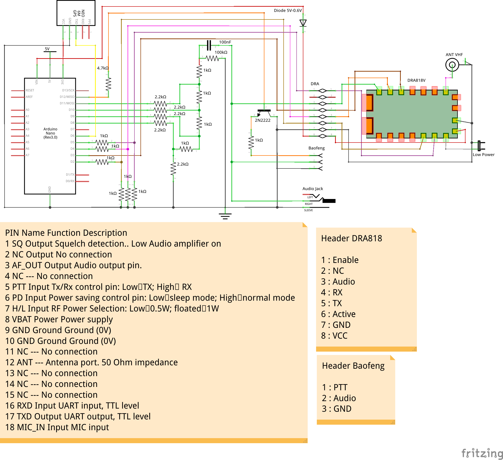

# GPS tracker on Ham radio APRS network with DRA818 module

## The projet

### Hardware parts used
- Arduino [nano](https://store.arduino.cc/arduino-nano)
- GPS Module ([NEO 6M](https://www.amazon.fr/NEO-6M-GPS-module-puissance-GY-GPS6MV2/dp/B01ICYA4QU))
- VHF TX module ([DRA818V](http://www.dorji.com/docs/data/DRA818V.pdf))

### Software parts used
- [PlatformIO](https://platformio.org/) (better than Arduino IDE)
- [QAPRS lib](https://bitbucket.org/Qyon/arduinoqaprs/src/master/) from Lukasz SQ5RWU
- [TinyGPS+ lib](http://arduiniana.org/libraries/tinygpsplus/)
- [DRA818 lib](https://github.com/fatpat/arduino-dra818) from Jereme Loyet

### The circuit

### The Arduino program

The project has one main function : **send its GPS coordinate on ham radio APRS network**.
To accomplish that it has 3 ways :
- With the DRA818V module
- With a Baofeng UV5-R/UVB5 etc connected to the board
- With an external TX by the jack connector

#### Program flow

1. At the startup, the Arduino try to detect if there is a DRA818 module plugged. If the connexion failed, it goes to the Baofeng mode.
*The sound (AX25) is always present on the jack connector and on Baofeng header pins. We don't have to use multiple options at the same time because sound "intensity" will decrease.*
2. If the GPS is locked and time is over or speed is high, it sends the coordinates.

## The author

My name is Valentin and my callsign is F4HVV.
I'm not good in electronics but I can do such project working approximately :)
